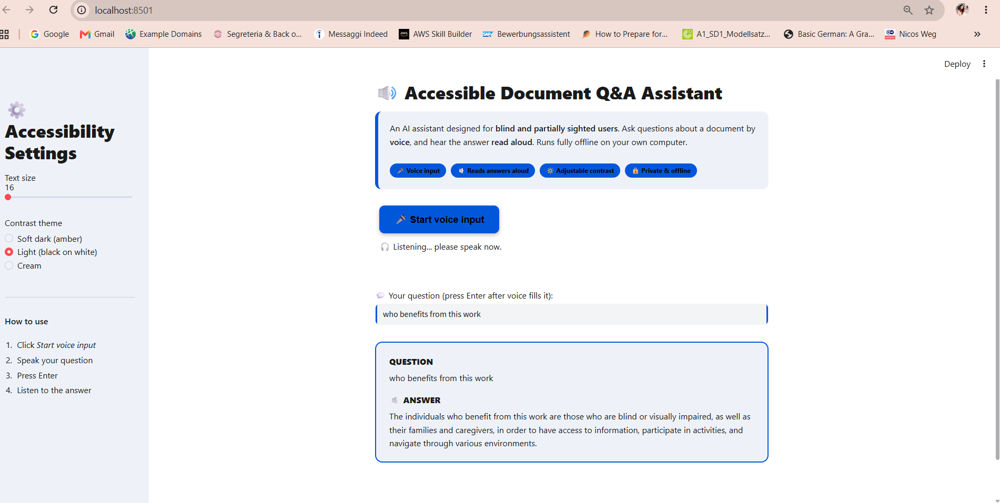

# Accessible Document Q&A Assistant

An accessibility-first AI assistant that lets users ask questions about a document by voice and hear the answer read aloud. Built for blind and partially sighted users, it runs fully offline on your own computer — no cloud, no API keys, no data leaves your machine.

Author: Khushbu Patil, Magdeburg, Germany

## Why this project

This project grew out of my MSc thesis, "Breaking Data Barriers — Web Accessibility for the Visually Impaired." Most document Q&A tools assume the user can see a screen and type. This one is designed around a different question: how would a blind or partially sighted person actually use it? That shaped every feature — voice input, spoken answers, and user-controlled contrast and text size.

## Features

- Voice input — speak your question instead of typing.
- Answers read aloud — every answer is spoken using the browser's speech synthesis.
- Adjustable contrast and text size — three high-contrast themes and a text-size slider, so each user sets what works for their vision.
- Private and offline — the document never leaves your computer.
- Grounded answers — responses come only from the document.

## How it works

This uses Retrieval-Augmented Generation (RAG): the document is split into chunks, converted into searchable vectors, and stored locally. When you ask a question, the most relevant chunks are retrieved and passed to a local language model, which answers using only that evidence.

## Tech Stack

- Interface: Streamlit
- Language model: Llama 3.2 via Ollama (runs locally)
- Embeddings: HuggingFace all-MiniLM-L6-v2 (runs locally)
- Vector database: ChromaDB
- Document reading: pypdf
- Voice input and output: Browser Web Speech API
- Language: Python

## How to Run Locally

Prerequisites: Python 3.10+ and Ollama installed (https://ollama.com/download).

1. Clone the repository and open the folder.
2. Create a virtual environment: python -m venv venv
3. Activate it: venv\Scripts\activate (Windows)
4. Install dependencies: pip install -r requirements.txt
5. Download the model once: ollama pull llama3.2
6. Put a PDF in the data folder, then run: streamlit run app.py

## How to Use

1. Click "Start voice input" and speak your question (or type it).
2. Press Enter.
3. The answer appears and is read aloud automatically.
4. Adjust text size and contrast in the sidebar.

Voice features work best in Google Chrome.

## What I Learned

- Designing for accessibility from the start, giving users control rather than assuming one design fits everyone.
- Building a complete RAG pipeline: loading, chunking, embedding, retrieval, and grounding.
- Running language models and embeddings fully locally with Ollama and HuggingFace.
- Integrating browser voice input and speech output with a Python backend.

## Limitations and Future Work

- Broad questions work less well than focused ones; better retrieval would improve this.
- The voice flow currently needs one key press to submit; a future version would be fully hands-free.
- Planned: PDF upload in the interface, source citations, and a spacebar shortcut for voice.

Built as a portfolio project exploring accessible AI.